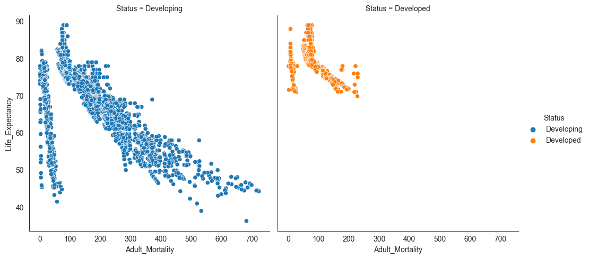
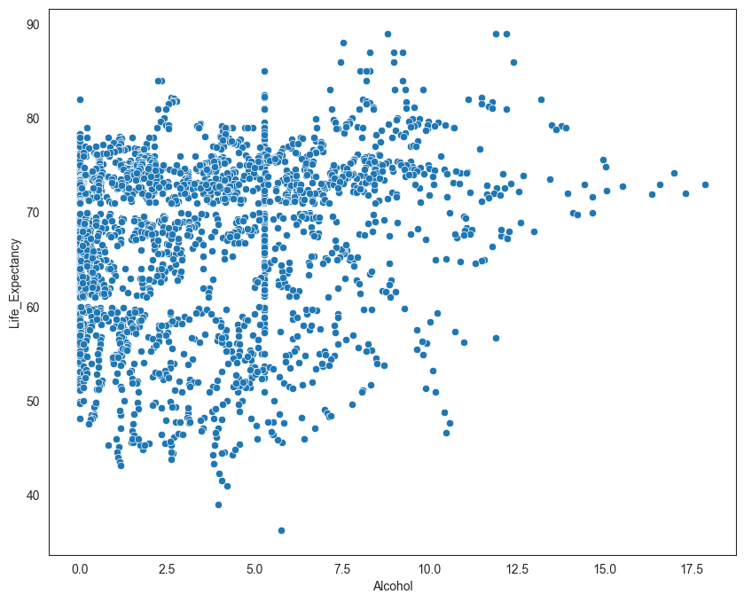
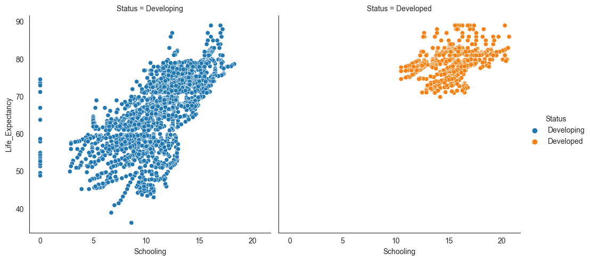

# Variables Description

- **country (Nominal):** The country in which the indicators are from (e.g., United States of America or Congo).
- **year (Ordinal):** The calendar year the indicators are from, ranging from 2000 to 2015.
- **status (Nominal):** Whether a country is considered to be 'Developing' or 'Developed' by WHO standards.
- **life_expectancy (Ratio):** The life expectancy of people in years for a particular country and year.
- **adult_mortality (Ratio):** The adult mortality rate per 1000 population, representing the number of people dying between 15 and 60 years per 1000 population.
- **infant_deaths (Ratio):** The number of infant deaths per 1000 population, similar to adult mortality but specifically for infants.
- **alcohol (Ratio):** A country's alcohol consumption rate measured as liters of pure alcohol consumption per capita.
- **percentage_expenditure (Ratio):** Expenditure on health as a percentage of Gross Domestic Product (GDP).
- **hepatitis_b (Ratio):** The number of 1-year-olds with Hepatitis B immunization over all 1-year-olds in the population.
- **measles (Ratio):** The number of reported Measles cases per 1000 population.
- **bmi (Interval/Ordinal):** The average Body Mass Index (BMI) of a country's total population.
- **under-five_deaths (Ratio):** The number of deaths of children under the age of five per 1000 population.
- **polio (Ratio):** The number of 1-year-olds with Polio immunization over the number of all 1-year-olds in the population.
- **total_expenditure (Ratio):** Government expenditure on health as a percentage of total government expenditure.
- **diphtheria (Ratio):** The Diphtheria tetanus toxoid and pertussis (DTP3) immunization rate of 1-year-olds.
- **hiv/aids (Ratio):** Deaths per 1000 live births caused by HIV/AIDS for people under 5; the number of people under 5 who die due to HIV/AIDS per 1000 births.
- **gdp (Ratio):** Gross Domestic Product per capita.
- **population (Ratio):** The population of a country.
- **thinness_1-19_years (Ratio):** The rate of thinness among people aged 10-19 (Note: variable should be renamed to thinness_10-19_years to more accurately represent the variable).
- **thinness_5-9_years (Ratio):** The rate of thinness among people aged 5-9.
- **income_composition_of_resources (Ratio):** The Human Development Index in terms of income composition of resources, which is an index ranging from 0 to 1.
- **schooling (Ratio):** The average number of years of schooling of a population.

These variables describe various indicators related to health, development, and demographics, which can be analyzed to gain insights into factors affecting life expectancy and overall well-being in different countries over time.

# Project Description

## Research questions
### 1.How does Infant and Adult mortality rates affect life expectancy?
### 2. Does Life Expectancy have positive or negative relationship with drinking alcohol ?
### 3. Does schooling have positive or negative impact on the life expectancy?

## Insights
### Insight 1: Infant and Adult Mortality Rates and Life Expectancy
There is a strong negative correlation between adult mortality rates and life expectancy. This suggests that higher adult mortality rates are associated with lower life expectancy. Similarly, although weaker, there is a negative correlation between infant deaths and life expectancy. However, it is important to handle outliers in the infant deaths data to obtain a more accurate correlation.

### Insight 2: Alcohol Consumption and Life Expectancy
The correlation analysis reveals a positive correlation (0.39) between alcohol consumption and life expectancy. However, this correlation is influenced by the country's development status. When separating the data by developing and developed countries, we find a weak positive correlation between alcohol consumption and life expectancy in developing countries, and a weak negative correlation in developed countries. This suggests that the relationship between alcohol consumption and life expectancy is complex and may be influenced by various factors.

### Insight 3: Schooling and Life Expectancy
There is a moderately strong positive correlation (0.71) between schooling and life expectancy. This indicates that higher levels of schooling are associated with higher life expectancy. Improved education and access to education can have a positive impact on various aspects of health and well-being, leading to increased life expectancy.

## Design Justifications

### Design Justification 1: Data Cleaning and Imputation
To ensure the accuracy of the analysis, data cleaning and imputation were performed. Whitespaces in column names were removed, and missing values were handled by imputing the mean value for each year. This approach allowed for a more complete dataset, enabling a more accurate analysis of the relationships between variables.

### Design Justification 2: Exploratory Data Analysis (EDA)
EDA was conducted to gain insights into the data and explore the relationships between variables. Visualizations such as line plots and scatterplots were used to analyze the trends and correlations. EDA helped identify patterns and associations, providing a foundation for further analysis and interpretation of the data.

### Design Justification 3: Handling Outliers
Outliers can significantly impact the analysis and interpretation of data. In the case of infant deaths, outliers were identified and handled by cutting the top and bottom 4% quantile. This approach allowed for a more accurate understanding of the correlation between infant deaths and life expectancy, mitigating the influence of misleading information.

## Critical Reflection on Limitations

### Limitation 1: Correlation Does Not Imply Causation
While correlation analysis provides insights into the relationships between variables, it is important to note that correlation does not imply causation. The identified correlations between variables in this project do not necessarily indicate a direct cause-and-effect relationship. Other confounding factors or underlying mechanisms may be at play, and further research is needed to establish causal relationships.

### Limitation 2: Data Quality and Representativeness
The quality and representativeness of the data used in the analysis can impact the validity and generalizability of the findings. The dataset used in this project may have limitations, such as missing data, imputation assumptions, or potential biases. It is important to consider the limitations of the data source and exercise caution when interpreting the results.

### Limitation 3: Limited Scope of Variables
The analysis focused on a specific set of variables related to life expectancy. While these variables provide valuable insights, they do not capture the entirety of factors influencing life expectancy. Other social, economic, and environmental factors may play significant roles in determining life expectancy but were not included in this analysis. Considering a broader range of variables could provide a more comprehensive understanding of the factors affecting life expectancy.

## References

### Dataset 
Link : https://www.kaggle.com/datasets/kumarajarshi/life-expectancy-who